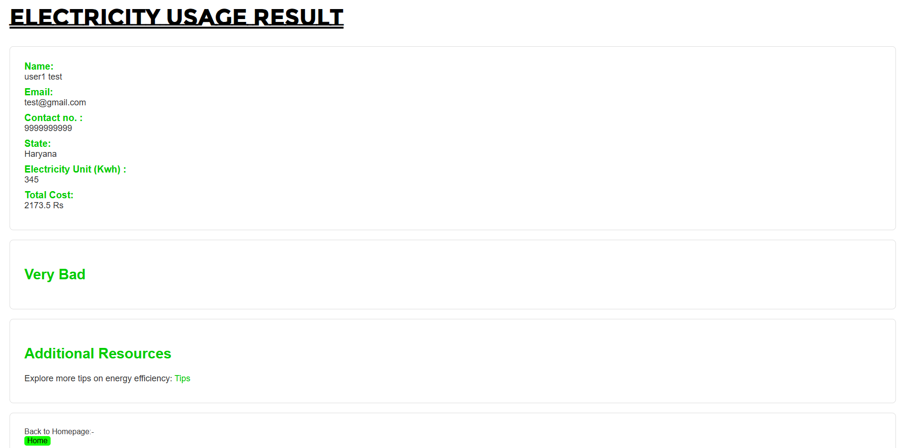

# Power Future (Power Lock) ⚡🌱

**Power Future** is an interactive web application designed to help users track electricity consumption, estimate monthly electricity costs based on state tariff slabs, and receive sustainability feedback to promote energy conservation.

🔗 **Live Demo:** [https://powerlock-9fce4.web.app/](https://powerlock-9fce4.web.app/)

---

## 📷 Preview



---

## ✨ Features

- **Sustainability Tracker:** State-wise electricity cost calculation (Delhi, Haryana, Uttar Pradesh Rural, Uttar Pradesh Urban).
- **Tariff Slab Rate Calculation:** Real-time unit-based calculation (kWh) dynamically evaluated upon form submission.
- **Sustainability Feedback:** Instant eco-rating feedback based on electricity cost tier (e.g., Very Good, Good, Medium, Bad, Very Bad).
- **Energy Conservation Tips:** Actionable tips to guide users toward reducing household electricity usage.
- **Clean Aesthetic UI:** Modern responsive web interface with background video hero sections and custom styling.

---

## 📁 Project Structure

```text
Power Future/
├── assets/                  # Project media (images, icons, video backgrounds)
│   ├── demo.png             # Application preview screenshot
│   ├── logo.jpg
│   └── ...
├── css/                     # Stylesheets for each page
│   ├── about.css
│   ├── form_style.css
│   ├── home_style.css
│   ├── navbar.css
│   ├── power_future_Style.css
│   ├── result.css
│   └── tips.css
├── js/                      # JavaScript logic files
│   └── result.js            # Calculation engine & DOM renderer
├── pages/                   # Additional page modules
├── .gitignore               # Ignored files for version control
├── .firebaserc              # Firebase configuration
├── firebase.json            # Firebase hosting config
├── index.html               # Homepage
├── power_future.html        # State selection page
├── form.html                # Electricity usage input form
├── result.html              # Result page showing cost & feedback
├── about.html               # About Us & Vision page
├── tips.html                # Sustainability tips page
└── README.md                # Project documentation
```

---

## 🚀 How to Run Locally

Since this is a client-side web application, no build process is required:

1. **Clone the repository:**
   ```bash
   git clone https://github.com/your-username/power-future.git
   cd power-future
   ```

2. **Open in Browser:**
   - Double-click `index.html` to open directly in any web browser.
   - **OR** serve using a local server (e.g., VS Code Live Server or `npx serve`):
     ```bash
     npx serve .
     ```
   - Open `http://localhost:3000` in your browser.

---

## 🌐 Deployment

The project is hosted using **Firebase Hosting**.

To deploy updates:
```bash
npm install -g firebase-tools
firebase login
firebase deploy
```

---

## 👥 Team Members

- **Pawan Kumar Ray**
- **Vanshika Sharma**
- **Samarth Yadav**
- **Kunal**

---

## 📜 License

This project is open-source and available under the [MIT License](LICENSE).
